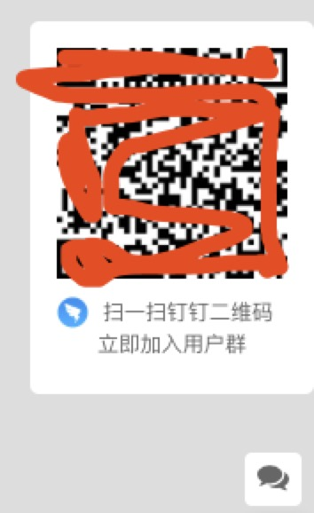

# react-side-qrcode
React component for website bottom right corner qrcode

## Installation
```js
  npm install react-side-qrcode --save
  or
  yarn add react-side-qrcode
```

## Introduction

## Example 
组件使用：
```js
import QRcode from 'sideQRcode';
import 'sideQRcode/lib/index.css';
  const options = {
    qrCodeUrl: '//xxx.xxx.com/Hk6EEzh0G.png',//picture url
    logoUrl: '//xxx.xxx.com/B1qBEMnAf.png',//picture url
    iframeId: '',//if your website has iframe is iframe->id
  };
return (
  <QRcode {...options} />
)
```
参数：
  qrCodeUrl->二维码url    

  logoUrl-> 二维码下行小图标logo    

  iframeId-> 如果页面嵌入iframe为iframe的id    

    

    

    
